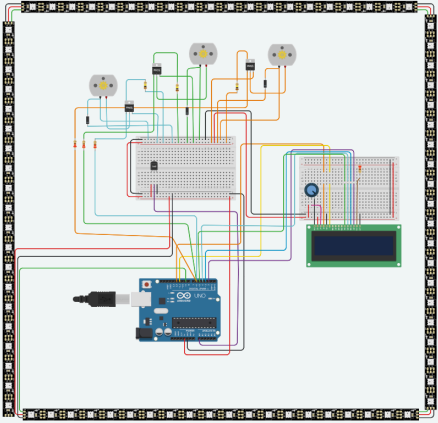

# Heat Management System

A real-time temperature-controlled cooling system built on Arduino Uno,
simulated in Tinkercad Circuits. The system reads ambient temperature via
a TMP36 sensor and responds by adjusting fan speed, updating an LCD display,
and changing an 80-LED NeoPixel strip color — all driven by threshold-based
PWM control logic.

> **Group Project** — MTE301 (Programming for Mechatronics), Toronto Metropolitan
> University, Fall 2025.  
> Team: Dwij Joshi · Abed Alabbar · Mueez Ahmad Nauman · Melika Olfatian

---

## Demo

🎥 [Watch the system running in Tinkercad](https://drive.google.com/file/d/1VpTJ4co069IVP9ye21-jUlkiR7aFuhzc/view?usp=drive_link)

---

## Hardware Components

| Component | Role |
|---|---|
| Arduino Uno R3 | Main controller (ATmega328P, 16 MHz) |
| TMP36 Analog Sensor | Temperature sensing via ADC on A0 |
| DC Fan + PMOS Driver | PWM-controlled cooling actuator |
| 16×2 LCD Display | Real-time temperature and fan % readout |
| 80-LED NeoPixel Strip | Color-coded thermal state indicator |

---

## Control Logic

| Temperature | Fan Speed | LED Color |
|---|---|---|
| ≤ 30°C | OFF (0%) | 🔵 Blue |
| 30–60°C | LOW (47%) | 🟢 Green |
| 60–85°C | HIGH (70%) | 🟡 Yellow |
| > 85°C | MAX (100%) | 🔴 Red |

**Key implementation detail:** The fan is driven through a PMOS high-side transistor,
which requires an inverted PWM signal (`analogWrite(FAN_PIN, 255 - fanSpeed)`).
Getting this wrong causes the fan to run backwards — one of the first bugs we caught
in simulation.

---

## Repository Structure
